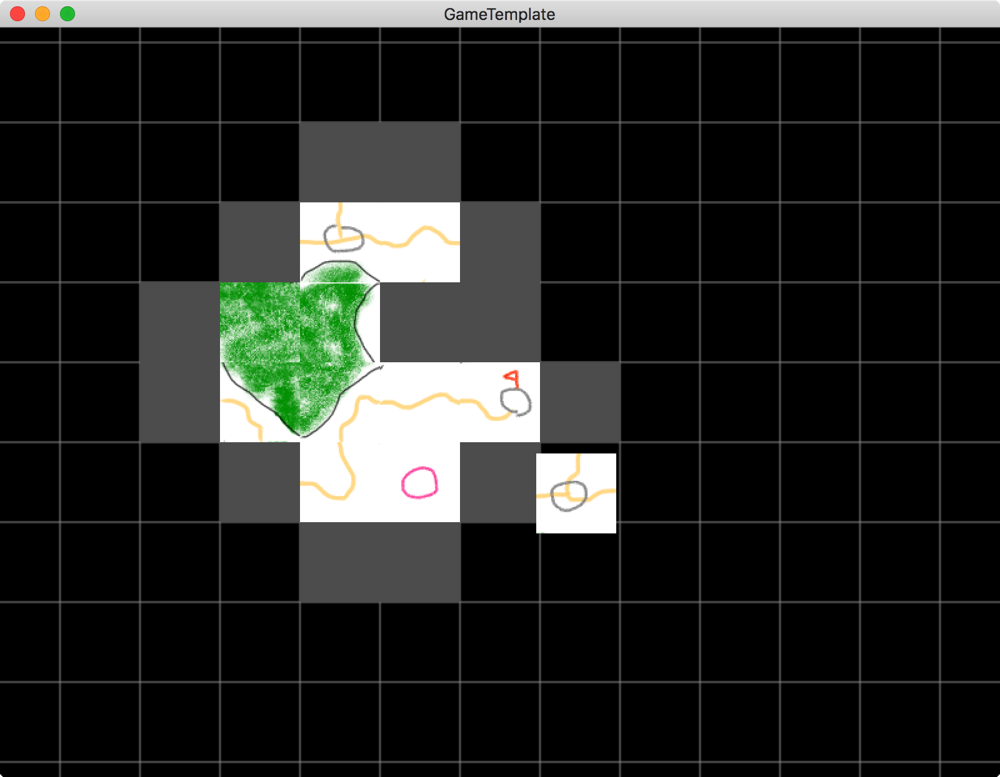

# Prototype game inspired by Carcassonne

## 概要
「2018年とし始めひとりゲームジャム」で製作した試作版ゲーム。

+ 基本的なルールはボードゲーム「カルカソンヌ」を踏襲
+ ゲームルールの検証用に進めたのでUI周りは雑
+ マウス右クリックで手持ちのパネルを回し、左クリックで場に置く

## 利用した外部ライブラリ
+ GameTempalte
  
  専門学校の授業で使っている拙作フレームワーク

+ OpenGL 1.1
+ GLFW 3.2.1
+ OpenAL
+ Eigen 3.3.3
+ stb_image 2.3.4
+ fontstash
+ stb_truetype 1.15

## License
License All source code files are licensed under the MPLv2.0 license

[MPLv2.0](https://www.mozilla.org/MPL/2.0/)
